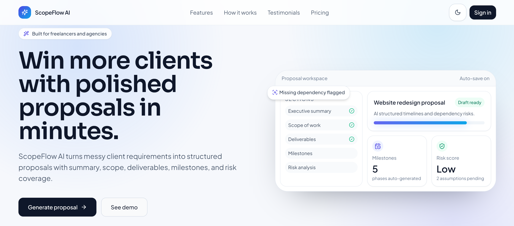
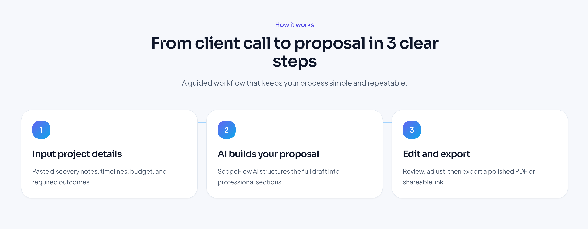
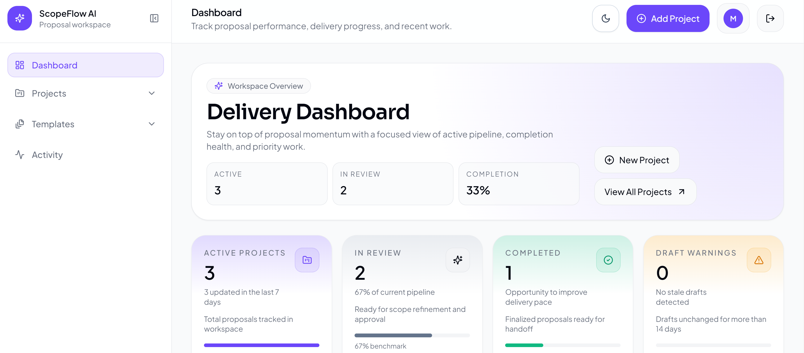
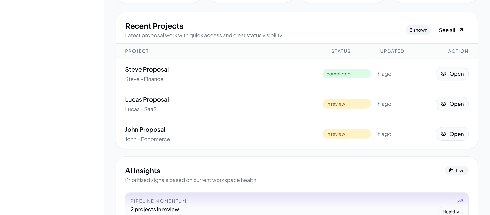
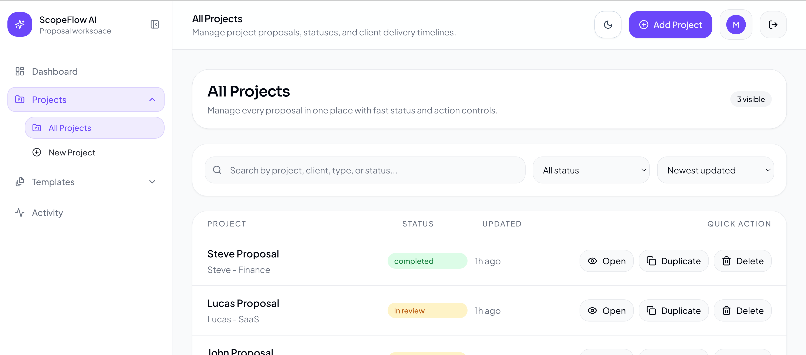
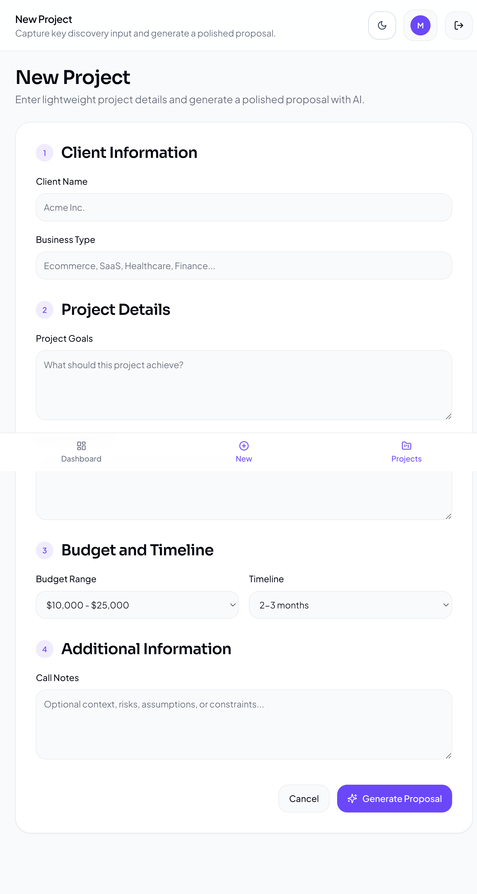
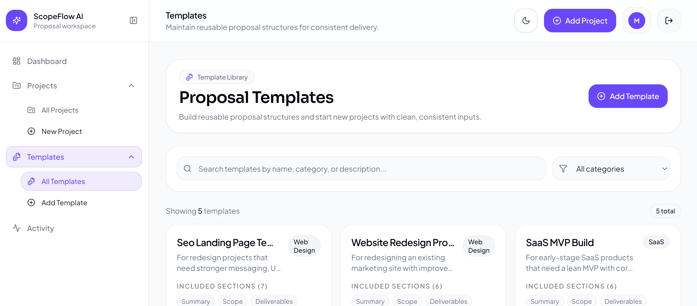
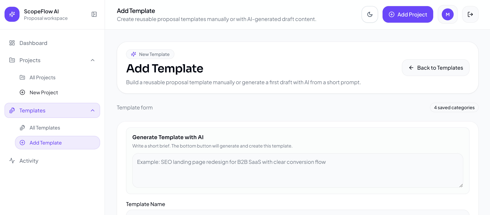
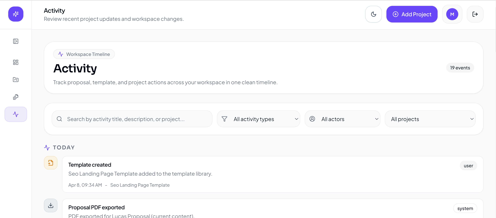

# ScopeFlow AI

AI-powered proposal workspace for freelancers and agencies.

ScopeFlow AI helps turn rough client requirements into structured proposals with AI-generated summaries, scope, deliverables, milestones, risks, templates, version history, and export tools.

---

## Live Demo

- **Frontend:** https://scope-flow-ai.vercel.app/
- **Repository:** https://github.com/skerdiD/ScopeFlow-AI

---

## Screenshots

### Landing



### Dashboard



### Projects



### Templates



### Activity


---

## Features

- AI proposal generation from client/project inputs
- Structured proposal sections:
  - Summary
  - Scope of work
  - Deliverables
  - Milestones
  - Risks
- Project dashboard with status overview
- Proposal version history and final version marking
- Template library for reusable proposal structures
- Activity timeline for project and workspace events
- Export flows for client delivery
- Search, filters, and quick actions across projects
- Rate limiting and request guards on AI endpoints
- Optimized list APIs and indexed backend queries

---

## Tech Stack

### Frontend
- React
- TypeScript
- Tailwind CSS
- React Router

### Backend
- Django
- Django REST Framework

### Database
- Supabase

### Auth / External
- Supabase token verification
- AI generation workflow

### Deployment
- Vercel (frontend)
- Render (backend)

---

## Main Pages

### Landing Page
Marketing page with product overview, CTA, pricing/testimonials sections, and animated hero.

### Dashboard
Shows:
- active projects
- in-review proposals
- completed proposals
- draft warnings
- recent projects
- AI insights
- recent activity

### Projects
List of proposals with:
- status badges
- updated timestamps
- search and filters
- open / duplicate / delete actions

### New Project
Form for:
- client info
- business type
- goals
- required features
- budget
- timeline
- notes

### Project Detail
Includes:
- project summary
- scope of work
- deliverables
- milestones
- risks
- editable project details
- proposal sections
- version history
- selected version preview

### Templates
Reusable proposal templates with categories, included sections, and quick-use actions.

### Activity
Timeline view of proposal generation, exports, status changes, and template actions.


## Performance / Security Highlights

### Performance
- route-level code splitting
- lightweight list serializer for project lists
- optimized querysets for list endpoints
- cached auth lookups with short TTL
- aggregate-based version lookup
- database indexes for common query paths

### Security
- stricter CORS / allowed hosts handling
- throttling on expensive AI generation endpoints
- request-size guards on generation routes
- hardened auth request handling
- reduced low-level error leakage
- dependency update for ORM advisory fix

---

## Example Workflow

1. Create a new project
2. Add client and project details
3. Generate proposal content with AI
4. Review and edit sections
5. Save new versions
6. Mark a final version
7. Export for delivery
8. Reuse successful structures through templates

---

## Why I Built It

Proposal creation is often repetitive and messy, especially when client requirements come from scattered notes and calls.

I built ScopeFlow AI to make that workflow faster, more structured, and easier to reuse inside a modern SaaS-style workspace.

---

## Folder Structure

```text
ScopeFlow-AI/
+-- client/
+-- server/
+-- database/
+-- README.md
```

---

## Future Improvements

- team collaboration
- comments / approvals
- richer analytics
- background jobs for heavy AI tasks
- notifications and reminders
- more export formats

