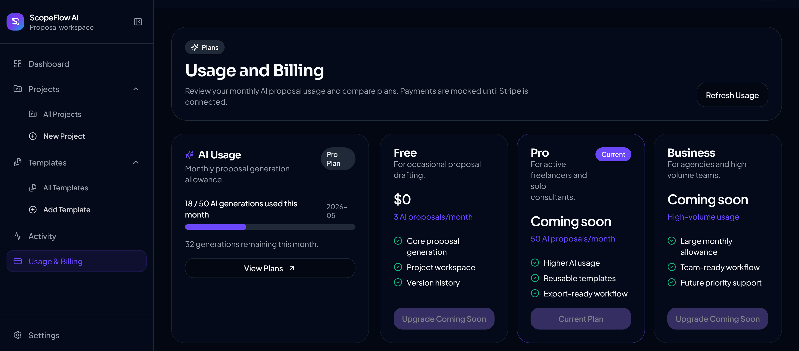

# ScopeFlow AI
**ScopeFlow AI** is a modern full-stack AI-powered proposal workspace that turns rough client requirements, project notes, and discovery details into structured, client-ready proposals.
It helps freelancers and agencies create projects, generate proposal content with Gemini AI, review proposal quality, manage versions, track usage, reuse templates, seed demo data, and export polished proposals inside a protected SaaS-style workspace.
[Live Demo](https://scope-flow-ai.vercel.app/) | [Dashboard Demo](https://scope-flow-ai.vercel.app/dashboard) | [Repository](https://github.com/skerdiD/ScopeFlow-AI)

---
## Preview

Explore the deployed app: [scope-flow-ai.vercel.app/dashboard](https://scope-flow-ai.vercel.app/dashboard)

### Landing Page


### SaaS Dashboard




---
## Overview
Proposal work is often scattered across calls, notes, messages, client documents, and repeated manual writing.
Freelancers and agencies lose time turning rough requirements into clear scope, deliverables, pricing, risks, and timelines.
ScopeFlow AI solves this by bringing the proposal workflow into one focused SaaS workspace.
Users can create client projects, generate structured proposals with Gemini AI, review AI quality scores, improve proposal content, manage versions, mark final proposals, export DOCX/PDF files, and reuse templates.
The app also includes usage tracking, demo seeding for screenshots, protected backend access, frontend quality checks, backend tests, CI workflows, and production-minded security configuration.
This project demonstrates full-stack SaaS development, practical AI integration, authenticated APIs, proposal workflow design, testing, deployment, and product thinking beyond a basic AI wrapper.

---
## Key Features
### AI Proposal Generation
- Generate structured proposals from rough client inputs
- Create summaries, scope, deliverables, pricing, risks, and next steps
- Use Gemini AI through protected backend endpoints
- Keep AI provider logic and keys server-side
### AI Quality Review
- Review proposals with an AI quality score
- Show strengths, weaknesses, and recommendations
- Help users improve clarity and client readiness
- Display review results inside project details
### Proposal Improvement
- Regenerate and improve proposal content
- Refine weak sections after the first AI draft
- Preserve version history and final proposal flow
- Keep proposal editing connected to one project
### Project Workspace
- Create client proposal projects
- Store client, business, goals, budget, timeline, and notes
- Track active, in-review, completed, and draft states
- Search, filter, open, update, and delete projects
### Versions and Templates
- Save proposal versions
- Mark final client-ready versions
- Create reusable proposal templates
- Reuse sections for repeated service offers
### Usage and Billing
- Show AI usage inside the app
- Track plan-style generation limits
- Display used and remaining generations
- Prepare a foundation for future Stripe billing
### Dashboard and Activity
- Show pipeline health at a glance
- Track active, in-review, completed, and stale draft work
- Display recent projects and AI insights
- Show recent workspace activity
### Export and Demo Data
- Export proposal content to DOCX
- Export proposal content to PDF
- Seed realistic demo data for screenshots
- Reset known demo records safely
### Security and Reliability
- Supabase authentication
- User-scoped backend access
- Production-safe CORS and allowed hosts
- Frontend linting, type-checking, Vitest tests, and GitHub Actions CI
- Backend tests with PostgreSQL CI

---
## Tech Stack
### Frontend
- React
- TypeScript
- Vite
- Tailwind CSS
- React Router
- Lucide React
### Backend
- Django
- Django REST Framework
- REST API endpoints
- Authenticated request handling
- Proposal, template, activity, usage, and export logic
### Database and Auth
- Supabase Auth
- PostgreSQL
- Supabase token verification
- User-scoped project data
- Indexed backend query paths
### AI Layer
- Google Gemini API
- Structured proposal generation
- AI quality review
- Proposal improvement workflow
- Backend-only AI calls
### Testing and Deployment
- Vitest
- React Testing Library
- ESLint
- TypeScript checks
- GitHub Actions
- Vercel and Render

---
## Architecture Overview
ScopeFlow AI uses a split full-stack architecture with React, Django REST Framework, Supabase authentication, PostgreSQL storage, and Gemini AI.
```txt
React Client
  |-- Vite
  |-- TypeScript
  |-- Tailwind CSS
  |-- Dashboard
  |-- Projects
  |-- Templates
  |-- Usage and Billing

Auth Layer
  |-- Supabase Authentication
  |-- Protected Routes
  |-- Token-Based API Access
  |-- User-Scoped Data

Backend API
  |-- Django REST Framework
  |-- Proposal Endpoints
  |-- Template Endpoints
  |-- Activity Endpoints
  |-- Usage Endpoints
  |-- Export Endpoints
  |-- AI Review Endpoints

Data and AI Layer
  |-- PostgreSQL
  |-- Projects
  |-- Proposal Versions
  |-- Templates
  |-- Activity Logs
  |-- Usage Records
  |-- Quality Reviews
  |-- Google Gemini

Quality Layer
  |-- Environment Variables
  |-- User Ownership Checks
  |-- Backend Tests
  |-- Frontend CI
```

---
## Getting Started
### 1. Clone the repository
```bash
git clone https://github.com/skerdiD/ScopeFlow-AI.git
cd ScopeFlow-AI
```
### 2. Install frontend dependencies
```bash
cd client
npm install
```
### 3. Create frontend environment variables
Create a `.env` file inside the `client` folder:
```env
VITE_API_BASE_URL=
VITE_API_URL=
VITE_SUPABASE_URL=
VITE_SUPABASE_ANON_KEY=
```
### 4. Start the frontend
```bash
npm run dev:web
```
### 5. Install backend dependencies
Open a second terminal from the project root:
```bash
cd server
python -m venv venv
venv\Scripts\activate
pip install -r requirements.txt
```
### 6. Create backend environment variables
Create a `.env` file inside the `server` folder:
```env
SECRET_KEY=
DEBUG=True
ALLOWED_HOSTS=127.0.0.1,localhost
CORS_ALLOWED_ORIGINS=http://127.0.0.1:5173,http://localhost:5173
DATABASE_URL=
SUPABASE_URL=
SUPABASE_ANON_KEY=
GEMINI_API_KEY=
GEMINI_MODEL=gemini-2.5-flash
```
### 7. Run database migrations
```bash
python manage.py migrate
```
### 8. Seed demo data, optional
```bash
python manage.py seed_demo_data
python manage.py seed_demo_data --reset
```
### 9. Start the backend
```bash
python manage.py runserver
```
Open the frontend at:
```txt
http://localhost:5173
```

---
## Product Flow
1. User signs in through Supabase authentication.
2. User creates a new client project.
3. User adds goals, requirements, budget, timeline, and notes.
4. Gemini AI generates a structured proposal draft.
5. User reviews sections and improves weak content.
6. AI quality review scores the proposal.
7. User saves versions while refining the offer.
8. User marks the best version as final.
9. User exports the proposal to DOCX or PDF.
10. User reuses templates for future client work.

---
## Available Scripts
### Frontend
```bash
npm run dev:web
npm run build
npm run preview
npm run lint
npm run typecheck
npm run test
npm run test:watch
```
### Backend
```bash
python manage.py runserver
python manage.py migrate
python manage.py test proposals
python manage.py seed_demo_data
python manage.py seed_demo_data --reset
```

---
## Main Pages
- Landing page for product explanation and CTA
- Dashboard for proposal pipeline overview
- Projects page for managing client work
- Project details page for proposal editing and review
- Templates page for reusable proposal structures
- Activity page for workspace history
- Usage and billing page for AI usage visibility

---
## Project Highlights
ScopeFlow AI demonstrates:
- Full-stack SaaS application development
- AI-powered proposal generation with Gemini
- AI quality review and proposal improvement
- Proposal version history and final proposal workflows
- Template-based proposal reuse
- Usage and billing foundation
- Protected authenticated backend APIs
- User-scoped data access
- Export workflows for DOCX and PDF
- Demo data seeding for polished screenshots
- Frontend testing, linting, type-checking, and CI
- Backend PostgreSQL testing with GitHub Actions
- Deployment across Vercel and Render

---
## Author
Built by **skerdiD**.
GitHub: [@skerdiD](https://github.com/skerdiD)
