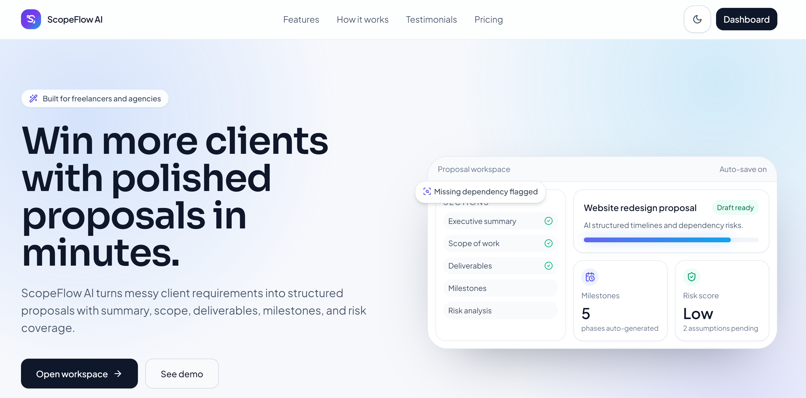
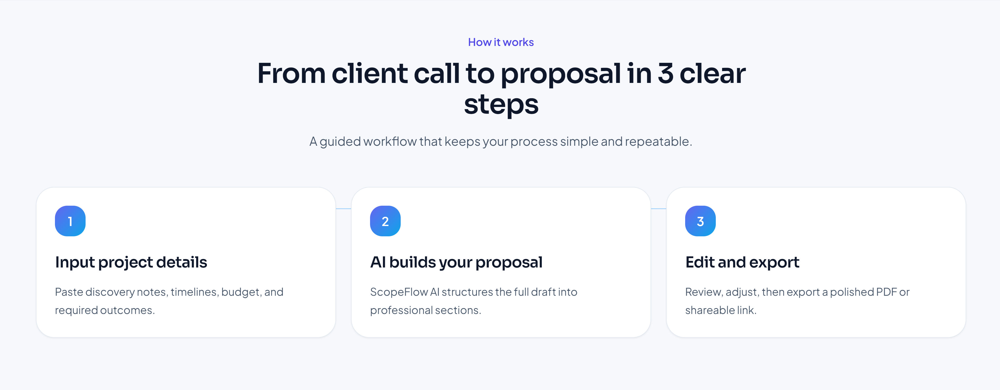
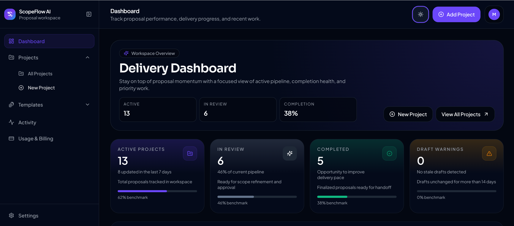
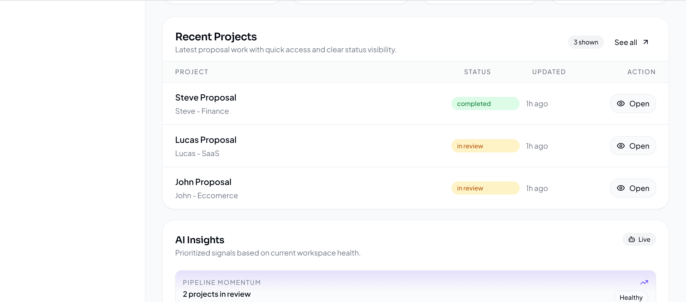
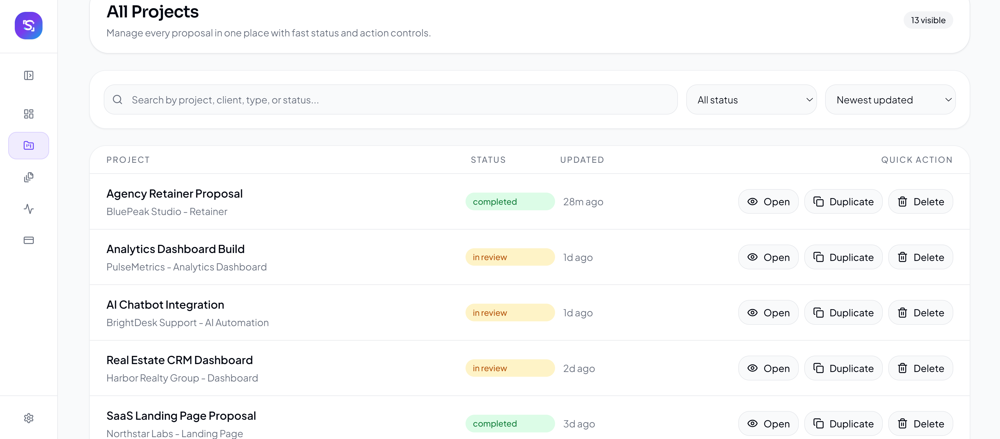
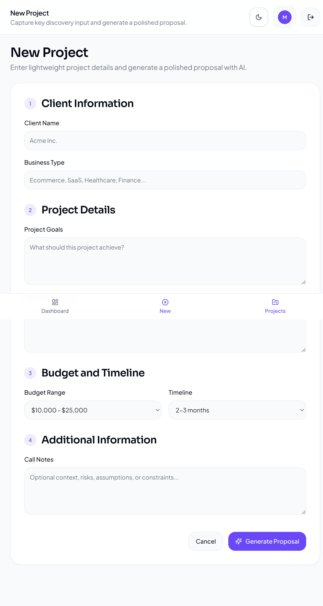
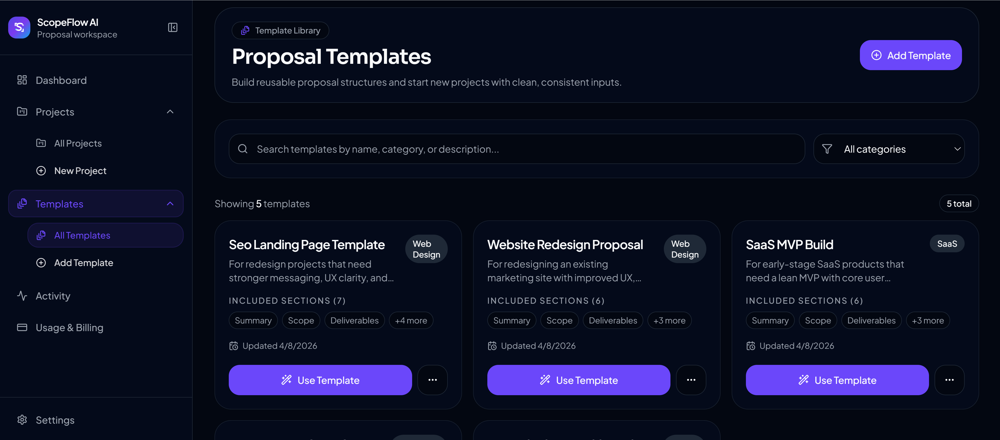
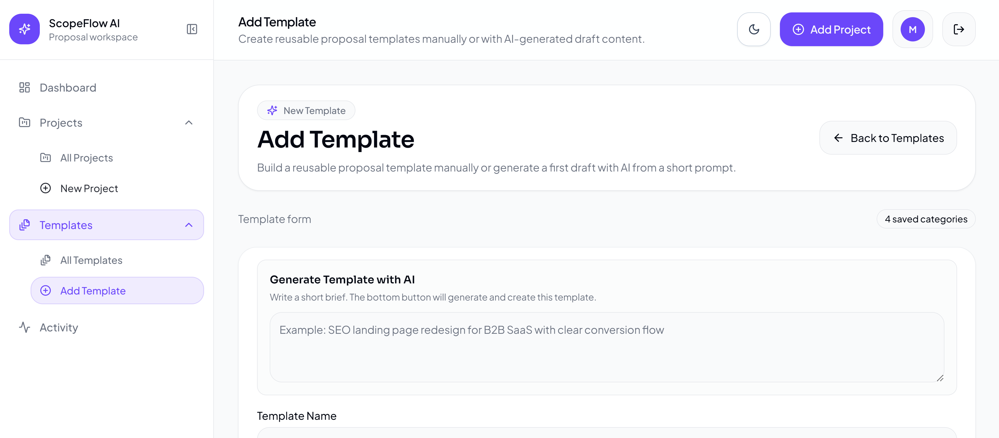
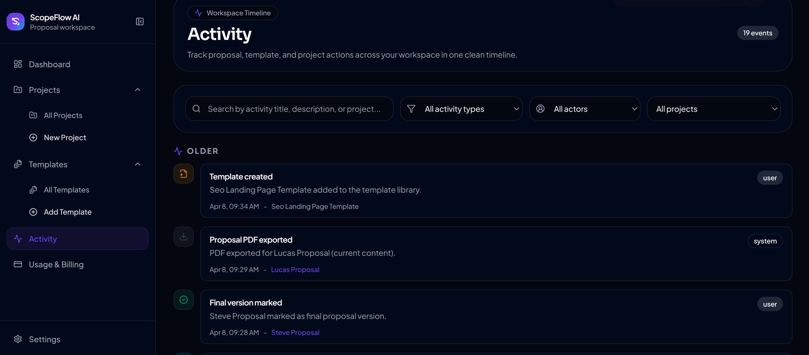

# ScopeFlow AI

**ScopeFlow AI** is an AI-powered proposal workspace built for freelancers and agencies to turn rough client requirements into structured, reusable, client-ready proposals.

It helps users generate proposal summaries, scope of work, deliverables, milestones, risks, templates, version history, and export-ready proposal content inside a clean SaaS-style workspace.

[Live Demo](https://scope-flow-ai.vercel.app/) · [Repository](https://github.com/skerdiD/ScopeFlow-AI) · [Features](#features) · [Tech Stack](#tech-stack) · [Getting Started](#getting-started)

---

## Preview

### Live App

https://scope-flow-ai.vercel.app/

### Landing Hero



### Landing How It Works



### Dashboard Overview



### Dashboard Projects and Insights



### Projects List



### New Project Mobile Form



### Templates Library



### Create Template



### Activity Timeline



---

## Overview

Most proposal workflows are messy. Client requirements often come from calls, notes, messages, and scattered documents. ScopeFlow AI was built to make that workflow more structured, faster, and easier to reuse.

The app includes project creation, AI proposal generation, structured proposal sections, reusable templates, proposal versions, final-version marking, activity tracking, export flows, search, filters, quick actions, and a polished SaaS-style interface.

The goal was not only to build an AI wrapper, but to show full-stack product thinking: workflow design, AI integration, backend API design, security, performance, reusable UI, and business value.

---

## Features

### AI Proposal Generation

* Generate proposal content from rough project inputs
* Turn client requirements into structured proposal sections
* AI-generated summary, scope, deliverables, milestones, and risks
* Proposal workflow designed for freelancers and agencies
* Request guards and throttling on expensive AI endpoints

### Project Workspace

* Create new client/project workspaces
* Store client details, business type, goals, required features, budget, timeline, and notes
* View projects with status badges and updated timestamps
* Search and filter projects
* Open, duplicate, and delete project actions
* Mobile-friendly project creation flow

### Proposal Sections

* Project summary
* Scope of work
* Deliverables
* Milestones
* Risks
* Editable project details
* Selected proposal version preview
* Final version marking

### Version History

* Save proposal versions
* Review previous generated versions
* Mark a final version
* Track proposal evolution over time
* Keep proposal work organized instead of overwriting everything

### Templates

* Reusable proposal templates
* Template categories
* Included proposal sections
* Quick-use actions
* Create new templates for repeated proposal structures

### Activity Timeline

* Timeline of proposal generation
* Export activity tracking
* Status change tracking
* Template activity tracking
* Workspace history for better visibility

### Export Flow

* Export-ready proposal workflow
* Client delivery preparation
* Useful for turning generated content into a shareable proposal output

### Security and Performance

* Stricter CORS and allowed-hosts handling
* Supabase token verification
* Throttling on AI generation endpoints
* Request-size guards on generation routes
* Hardened auth request handling
* Reduced low-level error leakage
* Route-level code splitting
* Optimized list APIs
* Indexed backend queries
* Cached auth lookups with short TTL
* Aggregate-based version lookup

---

## Tech Stack

### Frontend

* React
* TypeScript
* Tailwind CSS
* React Router
* SaaS-style component architecture

### Backend

* Django
* Django REST Framework
* REST API endpoints
* Authenticated request handling
* Optimized querysets

### Database and Auth

* Supabase
* Supabase token verification
* Indexed database queries
* Authenticated user/workspace data access

### AI and API Layer

* AI generation workflow
* Protected generation endpoints
* Request-size guards
* Rate limiting/throttling

### Deployment

* Vercel for frontend
* Render for backend
* Environment-based configuration

---

## Architecture Overview

ScopeFlow AI uses a split frontend/backend architecture.

```txt
Client App
  |-- React
  |-- TypeScript
  |-- Tailwind CSS
  |-- React Router
  |-- Project Dashboard
  |-- Proposal Workspace
  |-- Template Library

Backend API
  |-- Django
  |-- Django REST Framework
  |-- Auth Guards
  |-- Proposal Endpoints
  |-- Template Endpoints
  |-- Activity Endpoints
  |-- AI Generation Routes

Database/Auth Layer
  |-- Supabase
  |-- Token Verification
  |-- Project Data
  |-- Proposal Versions
  |-- Templates
  |-- Activity Events

AI Layer
  |-- Structured Prompt Workflow
  |-- Proposal Generation
  |-- Summary / Scope / Deliverables
  |-- Milestones / Risks

Security/Performance Layer
  |-- CORS / Allowed Hosts
  |-- Throttling
  |-- Request-Size Guards
  |-- Indexed Queries
  |-- Optimized List Serializers
```

The frontend focuses on a fast, clean SaaS workspace, while the backend handles authenticated API access, proposal generation, project data, templates, activity, and performance-sensitive query logic.

---

## Product Flow

1. A user opens the app and enters the workspace.
2. The user creates a new client project.
3. The user adds business details, goals, required features, budget, timeline, and notes.
4. ScopeFlow AI generates structured proposal content.
5. The user reviews summary, scope, deliverables, milestones, and risks.
6. The user saves versions and marks a final proposal.
7. The user exports the proposal for client delivery.
8. Successful proposal structures can be reused through templates.
9. Activity history keeps the workflow traceable.

---

## Main Pages

### Landing Page

Marketing page with product overview, CTA sections, product explanation, testimonials/pricing-style sections, and an animated hero.

### Dashboard

The dashboard gives users a high-level overview of:

* active projects
* in-review proposals
* completed proposals
* draft warnings
* recent projects
* AI insights
* recent activity

### Projects

The projects page helps users manage proposal work with:

* project cards/list
* status badges
* updated timestamps
* search
* filters
* open actions
* duplicate actions
* delete actions

### New Project

The new project flow collects:

* client information
* business type
* project goals
* required features
* budget
* timeline
* additional notes

### Project Detail

The project detail page includes:

* project summary
* scope of work
* deliverables
* milestones
* risks
* editable project details
* proposal sections
* version history
* selected version preview

### Templates

The templates page provides reusable proposal structures with:

* categories
* included sections
* quick-use actions
* create template flow

### Activity

The activity page shows a timeline of important workspace events, including proposal generation, exports, status changes, and template actions.

---

## Getting Started

### 1. Clone the repository

```bash
git clone https://github.com/skerdiD/ScopeFlow-AI.git
cd ScopeFlow-AI
```

### 2. Install frontend dependencies

```bash
cd client
npm install
```

### 3. Create frontend environment variables

Create a `.env` or `.env.local` file inside the `client` folder, depending on how the project is configured.

```env
VITE_API_URL=
VITE_SUPABASE_URL=
VITE_SUPABASE_ANON_KEY=
```

Use the exact environment variable names configured in the project if they differ.

### 4. Start the frontend

```bash
npm run dev
```

### 5. Install backend dependencies

Open a second terminal from the project root.

```bash
cd server
python -m venv venv
venv\Scripts\activate
pip install -r requirements.txt
```

### 6. Create backend environment variables

Create a `.env` file inside the `server` folder.

```env
SECRET_KEY=replace-with-a-strong-django-secret
DEBUG=True
ALLOWED_HOSTS=127.0.0.1,localhost
CORS_ALLOWED_ORIGINS=http://127.0.0.1:5173,http://localhost:5173
CSRF_TRUSTED_ORIGINS=http://127.0.0.1:5173,http://localhost:5173
FRONTEND_URL=

SUPABASE_URL=
SUPABASE_ANON_KEY=
SUPABASE_AUTH_CACHE_TTL=30

DATABASE_URL=

GEMINI_API_KEY=
GEMINI_MODEL=gemini-2.5-flash
```

For production on Render, set `DEBUG=False`, provide a strong `SECRET_KEY`, set `ALLOWED_HOSTS` to your backend host, and set `FRONTEND_URL` or `CORS_ALLOWED_ORIGINS` to your Vercel frontend origin. Never commit real secrets.

### 7. Run backend migrations

```bash
python manage.py migrate
```

### 8. Start the backend

```bash
python manage.py runserver
```

---

## Available Scripts

### Frontend

```bash
npm run dev       # Start the frontend development server
npm run build     # Build the frontend for production
npm run preview   # Preview the production frontend build
```

### Backend

```bash
python manage.py runserver    # Start the Django development server
python manage.py migrate      # Run database migrations
python manage.py test         # Run backend tests, if configured
```

---

## Performance and Security Highlights

### Performance

ScopeFlow AI includes several production-minded performance improvements:

* Route-level code splitting
* Lightweight list serializer for project list endpoints
* Optimized querysets for list endpoints
* Cached auth lookups with short TTL
* Aggregate-based version lookup
* Database indexes for common query paths
* Faster list views for project-heavy workspaces

### Security

The backend includes security-focused API hardening:

* Stricter CORS handling
* Allowed-hosts configuration
* Supabase token verification
* Throttling on expensive AI generation endpoints
* Request-size guards on generation routes
* Hardened auth request handling
* Reduced low-level error leakage
* Dependency update for ORM advisory fix

---

## What This Project Demonstrates

ScopeFlow AI shows experience with more than a basic AI text generator.

It demonstrates:

* Full-stack SaaS product architecture
* AI feature integration
* Proposal workflow design
* React frontend development
* Django REST API development
* Authenticated API access
* Supabase auth/token verification
* Template-based product workflows
* Version history and final-state logic
* Activity tracking
* Performance-focused backend queries
* Security-minded API hardening
* Deployment across Vercel and Render
* Business-focused product thinking

---

## Business Value

ScopeFlow AI represents the type of AI-powered workflow tool that freelancers, agencies, consultants, and service businesses can use to save time and create more consistent client proposals.

From a business perspective, this project supports:

* Faster proposal creation
* More structured client communication
* Reusable proposal templates
* Better version control for client work
* Reduced manual writing time
* More consistent proposal quality
* Faster delivery after discovery calls
* A foundation for a paid AI SaaS product

The strongest business value is not only the AI generation itself, but the workflow around it: projects, templates, versions, activity history, export flows, protected backend APIs, and a clean workspace that can grow into a real agency productivity platform.

---

## Folder Structure

```txt
ScopeFlow-AI/
├── client/       Frontend React application
├── server/       Django REST backend
├── database/     Database-related files
└── README.md
```

---

## Author

Built by **skerdiD**.

GitHub: [@skerdiD](https://github.com/skerdiD)
